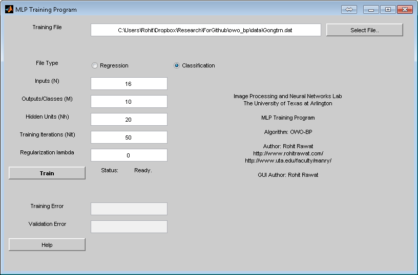

Basic Multilayer Perceptron (MLP) Training Program
==================================================

Image Processing and Neural Networks Lab,  
The University of Texas at Arlington.  
http://www.uta.edu/faculty/manry/

This program trains a multi-layer perceptron with one hidden layer.
Please see http://www.uta.edu/faculty/manry/new_software.html for
implementations of more advanced MLP training algorithms.

Approximation case
------------------
The training data has N inputs x and M outputs t. Patterns are arranged in rows
with a tab or space separating the elements.

x_1 x_2 ... x_N t_1 t_2 ... t_M

Example data file with N = 4, M = 2

    0.8147    0.0975    0.1576    0.1419    0.6557    0.7577
    0.9058    0.2785    0.9706    0.4218    0.0357    0.7431
    0.1270    0.5469    0.9572    0.9157    0.8491    0.3922
    0.9134    0.9575    0.4854    0.7922    0.9340    0.6555
    0.6324    0.9649    0.8003    0.9595    0.6787    0.1712

The first four columns are the inputs and the last two columns are the outputs.

Classification case
-------------------
The training data has N inputs x and M classes ic. Patterns are arranged in rows
with a tab or space separating the elements. The class numbers ic must start
from 1, going all the way to M.

x_1 x_2 ... x_N ic

Example data file with N = 4, Nc = 2

    0.6020    0.0838    0.9961    0.7749    2.0000
    0.2630    0.2290    0.0782    0.8173    1.0000
    0.6541    0.9133    0.4427    0.8687    2.0000
    0.6892    0.1524    0.1067    0.0844    2.0000
    0.7482    0.8258    0.9619    0.3998    1.0000
    0.4505    0.5383    0.0046    0.2599    1.0000

The first four columns are the inputs and the last column has the class numbers.

Other inputs
------------
N: inputs, M: outputs, Nh: the number of hidden units , Nit: the number of
training iterations/epochs.

Running the GUI
---------------
Run the program: "run_training.m"
Configure all the parameters in the GUI and press the "Train" button.
The program outputs can be seen in the MATLAB console. The network weights are
stored in the file weights.txt.

Running the console version
---------------------------
The console version of the program is provided in the hwo_molf_pruning folder.
please run the program "mlp_TRAIN.m", or "mlp_TRAIN_CLASS.m" to train a regression
or a classification model. Running these programs without any arguments prompts
the user for input on the command line. These can also be invoked as functions
and their prototypes are given below:

    [E_train] =
    mlp_TRAIN(training_file, N, M, Nh, Nit, validation_file)

    [E_train] =
    mlp_TRAIN_CLASS(training_file, N, M, Nh, Nit, validation_file)

The weights are stored into the file "weights.txt".

Processing or Testing
---------------------
Please run "mlp_PROCESSING.m" or "mlp_PROCESSING_CLASS.m" to obtain processing results
on new data. If the new data has the correct outputs available, a testing error
is calculated and displayed. The GUI for the testing program is "run_testing.m".

Included Sample Data
--------------------
One data set each of regression and classification types are provided in
the "data" folder.

Approximation:

Twod.tra, Twod.tst (testing)  
8 inputs, 7 outputs

Classification:

Gongtrn.dat, Gongtst.tst (testing)  
16 inputs, 10 output classes

Please see: http://www.uta.edu/faculty/manry/new_training.html for more
information on these files.

README version 1  
Rohit Rawat 08/26/2015
